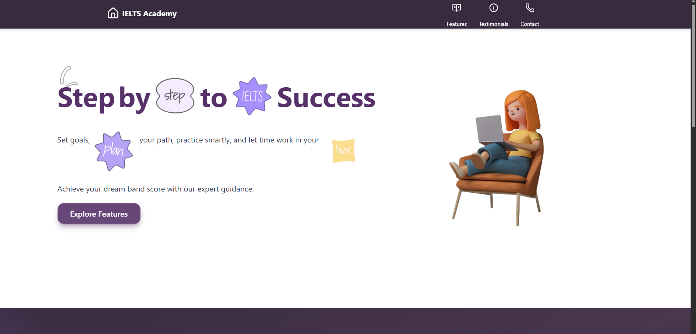
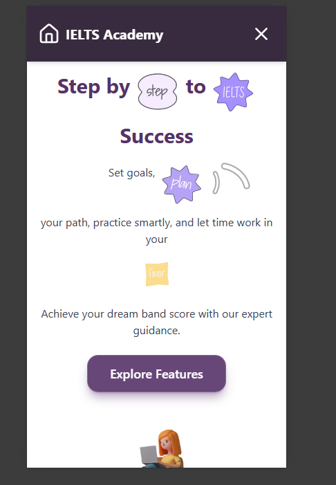

# IELTS Institute Homepage

A modern and **responsive homepage** for a fictional **IELTS Institute**, built using **React JS** and **Tailwind CSS**.  
This project demonstrates **UI/UX design skills**, smooth animations, responsiveness, and **clean, reusable React components**.  

> **GitHub Repo Description:**  
> IELTS Institute Homepage built with React, Tailwind, and Framer Motion. Features glassmorphism design, vibrant gradients, scroll animations, smooth scrolling, and fully responsive layout for mobile and desktop.

---

## 🌟 Features

- **Modern UI Design**
  - Glassmorphism effects for a premium, elegant look.
  - Vibrant gradient backgrounds for an eye-catching experience.
  - Smooth scrolling for a seamless navigation experience.

- **Responsive Layout**
  - Optimized for **desktop**, **tablet**, and **mobile** devices.

- **Engaging Animations**
  - Scroll-triggered animations to bring sections to life.
  - **Animated icons** powered by `useAnimation`.

- **Interactive Footer**
  - Custom footer with animated icons (video included below).

---

## 🌍 Live Preview

Check out the live deployed version of this project:  
**[View Live Site](https://fictional-x632-git-main-anju-kumaris-projects-d57c2c52.vercel.app/)**


## 📸 Screenshots & Preview

### **Laptop View**


### **Mobile View**


### **Footer Animation Video**
[Watch Footer Animation](src/asserts/footer.mp4)

---

## 🛠️ Tech Stack

- **React JS** – Component-based frontend
- **Tailwind CSS** – Styling and responsive design
- **Framer Motion** – Smooth animations
- **Scroll Animation** – Dynamic, on-scroll effects
- **Modern Color Palette** – Vibrant and professional gradients

---


## 🚀 Getting Started

Follow these steps to run the project on your local machine:

### 1. Clone the repository  
```bash
git clone https://github.com/logicscienc/Fictional.git
cd Fictional


1. Install the required packages.
    ```sh
   
    npm install
    ```

2. Start the development server.
    ```sh
    npm start
    ```
3. Open in Your browser
  ```sh
    http://localhost:5173
  ```
